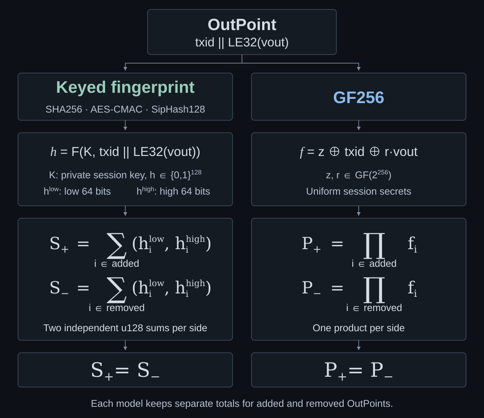

# SwiftSync aggregator benchmark

Compares SwiftSync OutPoint aggregators on two historical mainnet blocks: sums of 128-bit tags from keyed SHA256, AES-CMAC and SipHash128, and GF256 products.

## Run

You need Rust 1.87 or newer and a C compiler for `zstd`. Run the commands below from the repository root.

Hardware and software backends are benchmarked in separate builds. Software builds add a bit-at-a-time GF256 reference case.

| Build | SHA256 | AES-CMAC | SipHash128 | GF256 |
| --- | --- | --- | --- | --- |
| Native on ARM64 | ARM SHA2 if available, otherwise software | Hardware ARM AES | Scalar + NEON SIMD/interleaved | Hardware PMULL |
| Native on x86-64 | SHA-NI if available, otherwise software | Hardware AES-NI | Portable scalar code | Hardware PCLMULQDQ |
| Software on any CPU | Portable rust-bitcoin implementation | RustCrypto software AES | Scalar + NEON SIMD/interleaved on ARM64 | Portable optimized kernel |

### Native hardware

Requires both AES and carry-less multiplication instructions. The runner stops if either is unavailable instead of silently falling back.

```sh
cargo test
cargo run --release
```

### Software

Works on CPUs without those instructions, and forces software even on CPUs that have them:

```sh
RUSTFLAGS='--cfg aes_backend="soft"' cargo test --no-default-features --features software
RUSTFLAGS='--cfg aes_backend="soft"' cargo run --release --no-default-features --features software
```

All three settings are required: `--no-default-features` disables SHA256 hardware dispatch, `--features software` selects software GF256 and CMAC, and `RUSTFLAGS` disables hardware AES. The runner checks that AES acceleration is disabled.

Software AES uses RustCrypto's constant-time implementation.

Software GF256 uses integer multiplication with bit holes, Karatsuba and shift/XOR reduction, without carry-less multiplication instructions. Its fixed operations avoid secret-dependent branches and lookups, assuming constant-time integer multiplication on the host CPU.

Each run prints its backends. Append `-- --quick` for a short check.

Tests check GF256 against independent polynomial vectors and the bit-at-a-time reference, CMAC and SHA256 against OpenSSL vectors and SipHash against `siphasher`. Software builds also verify that hardware dispatch is disabled.

## What is timed?

Each case visits every non-coinbase input OutPoint and every UTXO-eligible output OutPoint (`OP_RETURN` and scripts over 10,000 bytes are excluded). The bundled compressed blocks are copies of Floresta's `block_367891/raw.zst` and `block_866342/raw.zst`. Their hashes and Merkle roots are checked before timing.

| Mainnet block | Inputs | Eligible outputs | Character |
| --- | ---: | ---: | --- |
| 367,891 | 20,817 | 852 | Input-heavy |
| 866,342 | 7,972 | 6,356 | More output work and txid reuse |

Timing includes fingerprinting, aggregator updates and the final merge. Decompression, parsing, txid calculation, output filtering and session-key setup are excluded.

Results report median microseconds per block across 11 rotating samples. `ns/record` divides this by the total input and eligible-output count. The time multiplier uses CMAC as the native baseline and scalar SipHash128 as the software baseline.

| Case | Timed strategy |
| --- | --- |
| Keyed SHA256 | First 128 bits of `SHA256(txid \|\| vout_le \|\| secret16)`, one compression per record |
| AES-CMAC | Fixed 36-byte message, reusing the txid work across a transaction's outputs |
| SipHash128 scalar | Fixed 36-byte scalar kernel with the same txid reuse |
| SipHash128 NEON (ARM64 only) | Four hashes per batch, using two interleaved two-lane NEON vector states and the same txid reuse |
| GF256 direct | Two interleaved product chains, computing each `r·vout` |
| GF256 common-vout | Four or eight chains with a 0–255 vout table and direct fallback |
| GF256 fast 0/1 | Four or eight chains with precomputed vouts 0 and 1 and direct fallback |
| GF256 bit-at-a-time (software build) | Independent reference using the direct/two-chain strategy |

NEON inputs can span transactions. Outputs reuse scalar txid prefixes, then batch their vout finalizations. Batch preparation and scalar tails are timed.

GF256 chains are independent partial products interleaved in one thread and merged at the end. They are not SIMD lanes or worker threads.

## Benchmarks

Results for block **866,342**. Cached GF256 cases use four chains, direct uses two.

### Apple M5 Pro (ARM64)

| Case | Native µs/block | × CMAC | Software µs/block | × SipHash128 |
| --- | ---: | ---: | ---: | ---: |
| Keyed SHA256 | 203.53 | 6.69 | 1,571.15 | 8.43 |
| AES-CMAC | 30.41 | 1.00 | 5,934.87 | 31.86 |
| SipHash128 scalar | 185.44 | 6.10 | 186.27 | 1.00 |
| SipHash128 NEON | 123.14 | 4.05 | 122.97 | 0.66 |
| GF256 direct | 54.61 | 1.80 | 689.97 | 3.70 |
| GF256 common-vout | 52.85 | 1.74 | 536.96 | 2.88 |
| GF256 vout 0/1 | 54.41 | 1.79 | 567.43 | 3.05 |

The software build disables AES, PMULL and SHA256 hardware dispatch, but retains NEON for the SIMD SipHash case.

## Why these designs?



| Design | Why consider it? | False-pass bound |
| --- | --- | --- |
| Keyed SHA256 | Familiar hardware-accelerated reference using the same widened sums | `2⁻¹²⁸` in the ideal-tag model, assuming secret-suffix SHA256 behaves as a PRF |
| AES-CMAC | Standardized MAC, fast with hardware AES | Same ideal bound, plus the CMAC PRF assumption |
| SipHash128 | Small, portable, with an ARM SIMD option | Same ideal bound, plus the SipHash PRF assumption |
| GF256 | Statistical check without a keyed-function assumption | `N / 2²⁵⁶`, or `2⁻²²⁴` at `N = 2³²` |

The additive designs' ideal bound assumes independent uniform 128-bit tags for distinct OutPoints. Their two widened sums cannot overflow with up to `2⁶⁴` records per side, including repetitions. Applying this model to a keyed function requires a PRF assumption: without the key, its outputs behave like those of a random function. The SHA256 case uses a secret suffix, not HMAC.

`N` is the larger count of added or removed OutPoints. GF256's bound follows from a nonzero polynomial evaluated at independent, uniformly random secrets `z` and `r`. It uses the same [random-product multiset-check idea](https://hackmd.io/Iuu9P7S5Sca0TCoYJ-sFdA) described for PLONK.

All bounds require fresh private secrets and records chosen independently of them. Benchmark keys are fixed **only for timing**.

Background: [SwiftSync proposal](https://gist.github.com/RubenSomsen/a61a37d14182ccd78760e477c78133cd), [CMAC specification](https://csrc.nist.gov/pubs/sp/800/38/b/upd1/final), [SipHash reference](https://github.com/veorq/siphash), and [PLONK's two-challenge product proof (Appendix A, Claim A.1)](https://eprint.iacr.org/2019/953.pdf#page=34).
